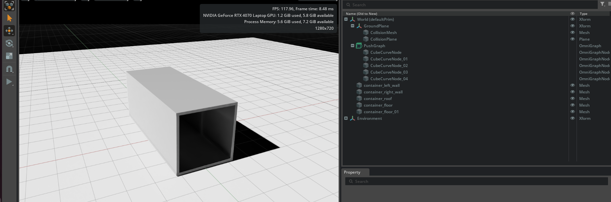
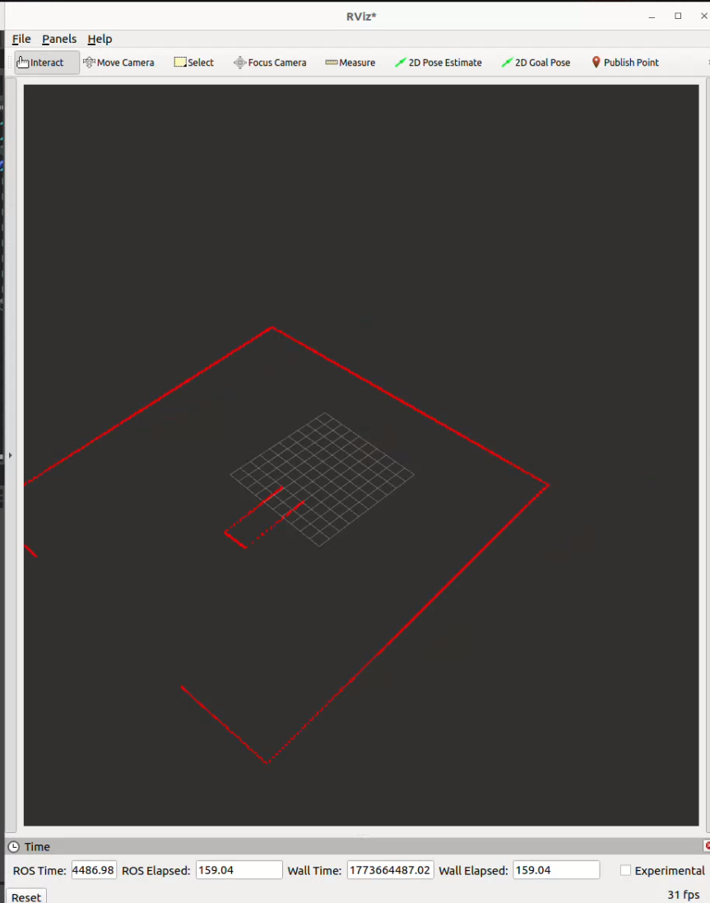
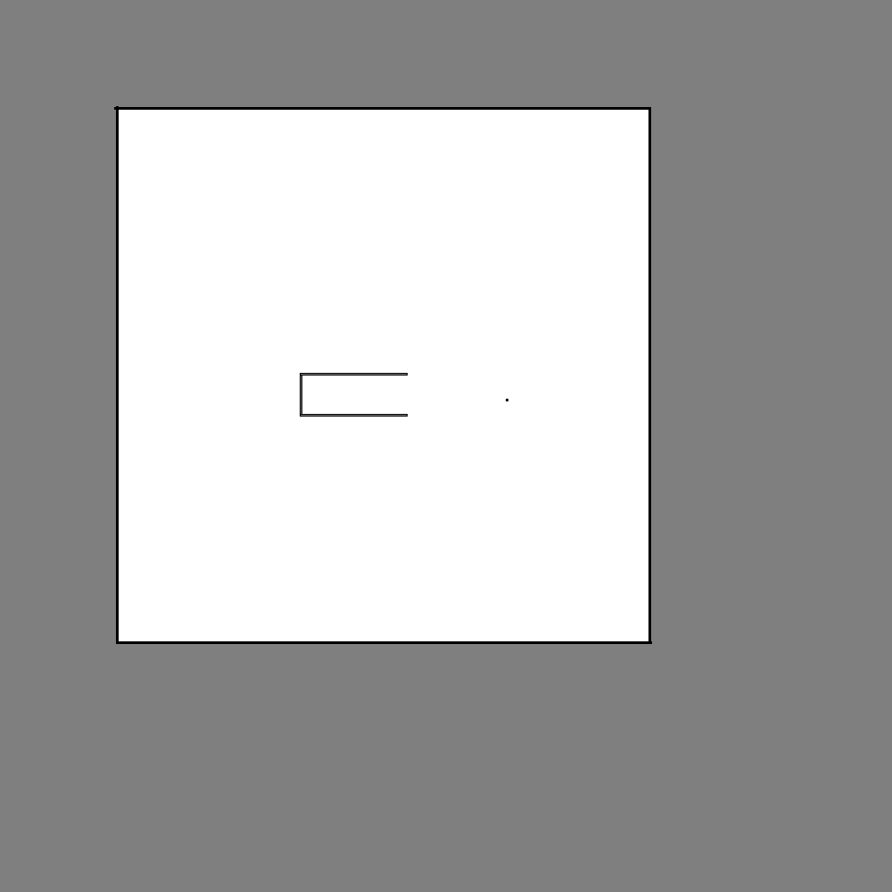

# Vegam Solution Assignment: Autonomous Container Entrance Detection

This repository contains a ROS 2 Humble package designed for a differential drive robot to detect and navigate towards a container entrance using 2D LiDAR data. The project is implemented in C++ and optimized for simulation in NVIDIA Isaac Sim.

## 🚀 Assumptions Made

* The Position/Height of the Lidar is higher than the Height of RAMP of the container.
* The data recieved from the 2D_Lidar is super accurate such that there is no need for using filter algorithms.  
* There is only one shape which has incavity as the container as shown in the occupancy map below.


## Setting Up Environment
### Prerequisites
* ROS 2 Humble with colcon pip package
* NVIDIA Isaac Sim
* I was using Debian Linux Ubuntu 22.04

### Steps
* Make a directory
    ```bash
    mkdir -p ros2_ws/src
    cd ros2_ws/src
    ```
* Get the repo with this command
    ```bash
    git clone https://github.com/RTK-jangid/Vegam_solutions_repo.git
    ```
* Now Open up the Isaac Sim and Load the ContainerScene.usd file.
    ```bash
    Vegam_solutions_repo/Isaac_world/container_scene.usd
    ```
* With this the bot and the container scene will be loaded in the Isaac sim.

* Now run the following commands to compile the Code.
    ```bash
    cd ~/ros2_ws
    colcon build --symlink --ros-args --params-file src/Vegam_solutions_repo/config/bot_params.yml
    source install/setup.bash
    ```
* Once everthing is Done. Start Isaac simulation from the play button and run this command in the terminal:
    ```bash
    ros2 run vegam_solution_assignment bot_controller
    ```

## Algorithm

### Main Idea
* Data from 2D Lidar is scanned at a regular interaval while the bot is scanning the area. So with that we are trying of detect the cornors of the container.

* Once the cornors are detected then we check the mid-point of the between the cornors if the middle-point has more distance then both the cornors then there is space to go between them. hence, detecting entrance of the container.

* With the Hold of the cornors of the entrance. we align the bot such that it is equally distant from the cornors.

* Then we again find the middle point of the cornors rotate the front towards the middle point then move forward torwards the entrance. 

### 🛠️ System Architecture

The project is split into two core classes:
1.  **`ContainerBot`**: Handles the hardware abstraction (or simulation API) for movement using `geometry_msgs/Twist`.
```bash
class ContainerBot
{
public:
    ContainerBot(const rclcpp::Node::SharedPtr &node);

    void moveForward(float velocity);

    void moveBackward(float velocity);

    void rotateRight(float angular_velocity);

    void rotateLeft(float angular_velocity);

    void stop();
---
};

```
2.  **`Detection`**: Manages the LiDAR subscription, threading, and the core entrance-finding logic.
```bash
class Detection
{
public:
    Detection(const rclcpp::Node::SharedPtr &node);
    ~Detection() = default;

private:
    void declareParameters();

    void startMainLoop();

    void startScanning();

    void alignWithContainer();

    void enterContainer();

    void exitContainer();

    int detectContainerEntrance(const sensor_msgs::msg::LaserScan::SharedPtr laser_scan_);
---
}
```
### Why only 2D-Lidar is used? 
* For keeping the computational cost low and for the given constraints it was suffient. Otherwise for more complex problems I would have gone for RGB-D camera which has more computional cost but makes perceiving pretty simple and faster. 

**A Simple system is the best System.**

### Key Features
* **Thread-Safe Processing:** LiDAR data is processed in a dedicated worker thread using `std::condition_variable` and `std::mutex` to ensure zero lag in the ROS 2 executor.
* **Confidence Scoring:** Requires 20 consecutive successful detections before triggering the "Entrance Detected" state.
* **Feature Extraction:** Implements a custom algorithm to detect corners and entrance midpoints using depth "jumps."
* **Parameter-Driven:** Control speeds, detection thresholds, and confidence levels via `.yaml` configuration.
* **Robust Detection:** Uses a confidence-based scoring system and reset counters to filter out LiDAR noise and transient obstacles.

## Gallery

